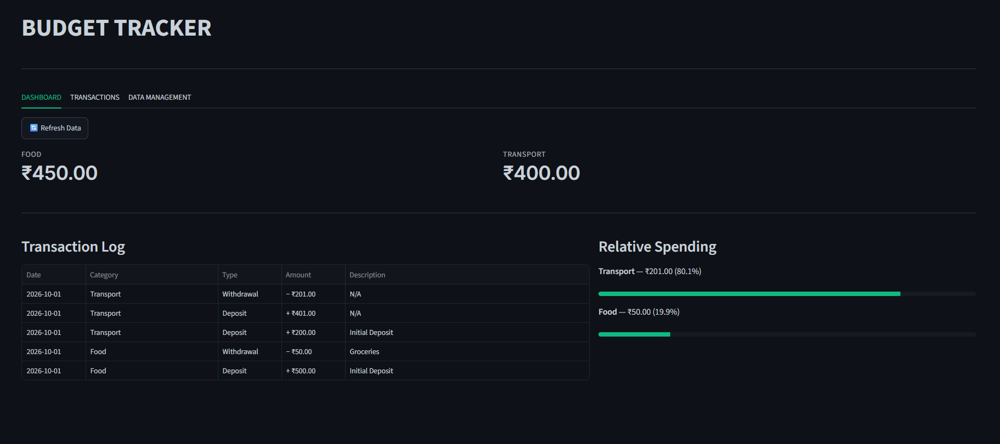

# budget-tracker

An interactive personal budget tracker and spending dashboard. Built with Python and Streamlit, featuring category-based budgeting, real-time analytics, and portable JSON data persistence.

## Preview



**🔗 [View Live Application](https://jatinp-budget-tracker.streamlit.app/)**

## Core Features

- **Category Budgeting:** Organize funds into custom or standard categories, record transactions, and transfer money between budgets with built-in balance validation.
- **Spending Analytics:** Visualize relative spending distribution with progress indicators and inspect chronological transaction history in an interactive data table.
- **Portable Data Management:** Save and restore complete ledgers instantly via standard JSON files with zero database setup required.
- **Data Safety Guardrails:** Destructive actions like factory resets or sample data overwrites are secured behind confirmation gates to prevent accidental data loss.

## Technical Overview

The application is built on a decoupled architecture. Core financial logic and error handling (`models.py`) are strictly separated from the Streamlit presentation layer (`app.py`). Data persistence is handled via stateless JSON serialization (`utils.py`). The repository is backed by a comprehensive `pytest` suite and a continuous integration pipeline (GitHub Actions) to maintain reliability.

## UI & Design

- **Responsive Layout:** The interface prioritizes primary actions on smaller devices, adapting complex layouts for readability without requiring excessive scrolling.
- **Custom Typography:** Utilizes the 'Inter' web font and uppercase tab headers to establish a clear, highly readable visual hierarchy.

## Tech Stack

- **Language:** Python
- **Framework:** Streamlit
- **Data Visualization:** Pandas, Streamlit Native Components
- **Testing & CI:** Pytest, GitHub Actions

## Running it Locally

1. Ensure you have Python installed on your system.

2. Clone the repository:

   ```bash
   git clone https://github.com/jatinpanigrahy/budget-tracker.git
   cd budget-tracker
   ```

3. Activate your virtual environment:

   ```bash
   python -m venv .venv
   # Windows (PowerShell):
   .\.venv\Scripts\Activate.ps1
   # macOS/Linux:
   source .venv/bin/activate
   ```

4. Install the required dependencies:

   ```bash
   pip install -r requirements.txt
   ```

5. Run the test suite:

   ```bash
   python -m pytest -v
   ```

6. Launch the application:

   ```bash
   streamlit run app.py
   ```

## Deployment

This application is deployed and hosted via Streamlit Community Cloud.

**Live Application:** <https://jatinp-budget-tracker.streamlit.app/>